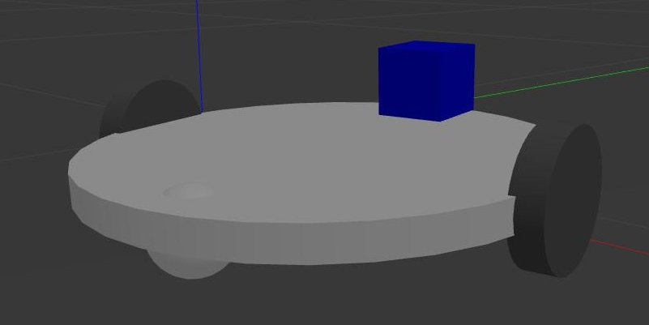

#  Giới thiệu


Robot bánh xe vi sai là loại robot bánh xe được cấu trúc:
- Hai bánh điều khiển ở hai bên được gắn động cơ, bình thường hai bánh xe quay cùng tốc độ, muốn điều khiển robot sang phải thì tốc độ bánh xe bên phải phải nhỏ hơn bên trái, và ngược lại
- Một hoặc hai bánh xe cân bằng

Project này tạo robot bánh xe vi sai, mô phỏng trên gazebo và điều khiển chuyển động thông qua bàn phím.

# Mô phỏng điều khiển chuyển động trên Gazebo
- Hiển thị trên Gazebo:
```bash
$ source devel/setup.bash
$ roslaunch robot_banhxe_visai robot_banhxe_visai_gazebo.launch
```
- Điều khiển bằng bàn phím: mở một **Terminal** mới
```bash
$ roslaunch robot_banhxe_visai keyboard_teleop.launch
```

Quá trình điều khiển robot bằng bàn phím thì **Terminal** này phải active.
